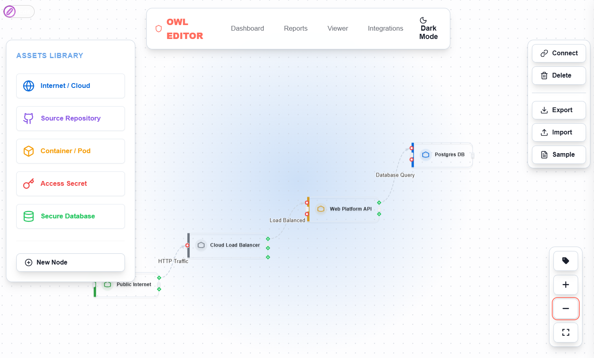

# sqlc-example-api

This repository provides starter code for creating a API using sqlc and the Gin web framework in Go. This is part of the Relational Database course as part of the Iknite Space training.

The API supports multiple data models for three main applications:

## **Telemetry & System Cleanup Application**
The dashboard endpoints power a telemetry application referred to as **owl security** that monitors and cleans development environments by identifying unused Docker containers, stale Git repositories, unnecessary cache files, exposed secrets, and system registry entries to optimize disk space and improve security.

**Repository**: [owl-security](https://github.com/Dyl777/owl_security) *(Under Development)*

## **Dynamic Schema Management**
Due to the broad scope of the telemetry application, the schema management system allows capturing new data types in production without downtime or migrations, enabling field addition/removal while maintaining backward compatibility as monitoring requirements expand.

## **Vulnerability Workflow Builder**
The workflow endpoints support an open-source node-flow builder (built on vis.js, similar to Wiz) that visualizes software pipelines and dependency chains as interactive graphs, showing how security vulnerabilities propagate through dependencies and affect downstream components.



**Repository**: [vulnerability-workflow-builder](https://github.com/Dyl777/owl_security/tree/preview) *(Under Development - Preview available at `editor.html` in preview branch)*

## Project Structure

* `api/`: Contains API route definitions and handler functions for all three applications
* `cmd/api/`: Houses the main application entry point
* `cmd/seed/`: Data seeding utility to populate the database with sample telemetry and workflow data
* `db/migrations`: SQL schema files for telemetry data, workflow storage, and dynamic schema management
* `db/query`: SQL query definitions processed by sqlc to generate type-safe Go code
* `db/repo/`: Generated repository code providing database abstraction (auto-generated, don't edit)
* `mysampledata/`: Sample JSON files representing telemetry data, workflow diagrams, and editor configurations

## Use Cases

### **Development Environment Cleanup**
```bash
# Find unused Docker containers consuming resources
GET /dashboard/containers?status=stopped

# Identify stale repositories for cleanup
GET /dashboard/repos

# Search for exposed secrets across the system
POST /schema/secret/search
{
  "location": "~/.ssh"
}
```

### **Dynamic Telemetry Capture**
```bash
# Add new monitoring field to containers in production
POST /schema/docker_container/container-123/fields
{
  "fieldPath": ["securityScan"],
  "value": {"lastScan": "2026-01-22", "vulnerabilities": 3},
  "isCustom": true
}

# Search containers by custom security metrics
POST /schema/docker_container/search
{
  "securityScan.vulnerabilities": {"$gt": 0}
}
```

### **Vulnerability Flow Analysis**
```bash
# Import software pipeline workflow
POST /workflow/import
{
  "nodes": [...], 
  "edges": [...],
  "vulnerabilities": {"node-1": ["CVE-2023-1234"]}
}

# Analyze vulnerability propagation paths
GET /workflow/workflow-123
# Returns nodes, edges, and vulnerability flow data
```

## API Endpoints


### Dashboard (Telemetry & Cleanup)
* `GET /dashboard/summary` - System overview with cleanup recommendations
* `POST /dashboard/containers` - Register Docker container for monitoring
* `GET /dashboard/containers` - List containers with resource usage and cleanup status
* `GET /dashboard/containers/:id` - Detailed container analysis
* `PUT /dashboard/containers/:id` - Update container monitoring data
* `POST /dashboard/repos` - Register Git repository for tracking
* `GET /dashboard/repos` - List repositories with staleness indicators

### System Data (Telemetry Collection)
* `POST /system/cache` - Record cache usage data by technology
* `GET /system/cache` - Analyze cache usage (filter by ?technology=Node.js)
* `GET /system/cache/:id` - Detailed cache analysis
* `POST /system/logs` - Capture system logs for analysis
* `GET /system/logs` - Query logs (filter by ?level=ERROR for cleanup opportunities)
* `GET /system/logs/:id` - Detailed log entry
* `POST /system/secrets` - Report discovered secrets/keys
* `GET /system/secrets` - List security findings for remediation
* `GET /system/secrets/:id` - Detailed secret analysis
* `POST /system/registry` - Record Windows registry entries
* `GET /system/registry` - List registry data for cleanup
* `GET /system/registry/:id` - Detailed registry entry
* `POST /system/plist` - Record macOS plist entries
* `GET /system/plist` - List plist data for optimization
* `GET /system/plist/:id` - Detailed plist entry

### Schema Management (Production Evolution)
* `GET /schema/:table` - Get current telemetry schema for table
* `POST /schema/:table` - Evolve schema definition for new monitoring needs
* `GET /schema/:table/versions` - Track schema evolution history
* `POST /schema/:table/:id/fields` - Add monitoring field to existing record
* `DELETE /schema/:table/:id/fields/:field` - Remove obsolete monitoring field
* `POST /schema/:table/search` - Query telemetry data by dynamic fields

### Workflows (Vulnerability Analysis)
* `POST /workflow` - Create software pipeline workflow
* `GET /workflow` - List vulnerability analysis workflows
* `GET /workflow/:id` - Get pipeline with vulnerability propagation data
* `POST /workflow/import` - Import complex dependency graph from vis.js
* `POST /workflow/config` - Configure vulnerability visualization settings
* `GET /workflow/config` - List visualization configurations
* `GET /workflow/config/:id` - Get specific visualization config

# Getting Started

## Prerequisites
* Go 1.19+ installed
* PostgreSQL database
* Git

## Setup Instructions

* **Fork & Clone**: Fork this repository and clone it to your local machine
```bash
git clone https://github.com/YOUR-GITHUB-USERNAME/sqlc-example-api.git
cd sqlc-example-api
```

* **Environment Setup**: Configure your database connection
```bash
cp .env.example .env
# Edit .env with your PostgreSQL connection details
```

* **Install Dependencies**: Download required Go modules
```bash
go mod tidy
```

* **Generate Database Code**: Create type-safe Go code from SQL
```bash
go generate ./...
```
This generates Go code in `db/repo/` from your SQL queries and schema definitions.

* **Start the API Server**: Launch the telemetry and workflow API
```bash
go run cmd/api/...
```
The server starts and displays available endpoints for telemetry collection and vulnerability analysis.

* **Seed Sample Data** (Optional): Populate with telemetry and workflow examples
```bash
go run cmd/seed/...
```
This imports sample Docker containers, repositories, cache data, and vulnerability workflows.

## Development Workflow

### Adding New Telemetry Data Types
1. **Add SQL queries** in `db/query/` for new monitoring data
2. **Run code generation**: `go generate ./...`
3. **Create API handlers** in `api/` for the new endpoints
4. **Update routes** in `api/api.go`
5. **Test with sample data** using the seeding script

### Evolving Schema in Production
1. **Use dynamic fields** via `/schema/:table/:id/fields` endpoints
2. **No migrations needed** - JSONB fields handle new data structures
3. **Maintain backward compatibility** automatically
4. **Query new fields** using the search endpoints

### Building Vulnerability Workflows
1. **Design pipeline** using the vis.js-based workflow builder
2. **Import workflow** via `POST /workflow/import`
3. **Add vulnerability data** to nodes and edges
4. **Analyze propagation** through the dependency graph
